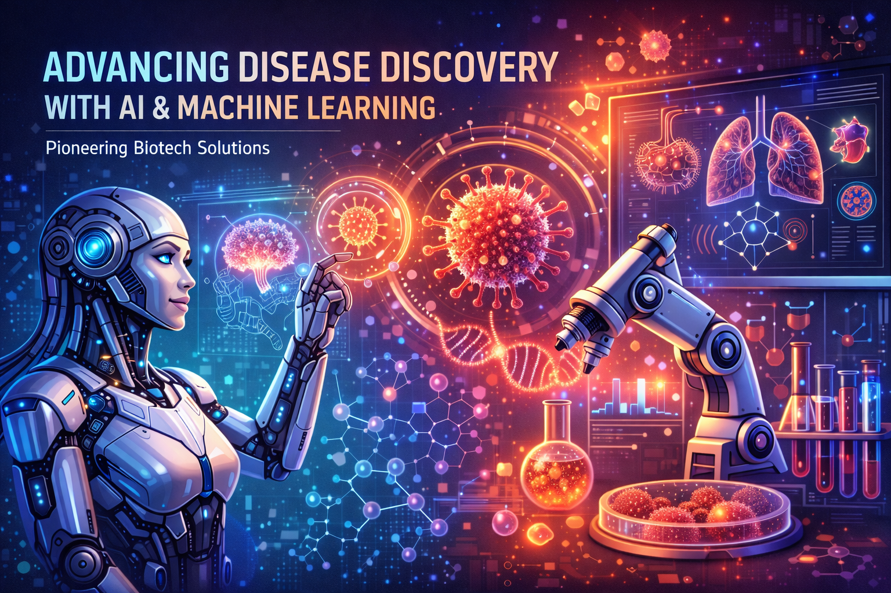
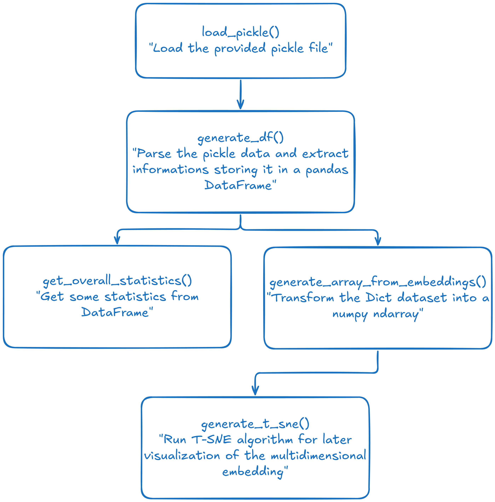
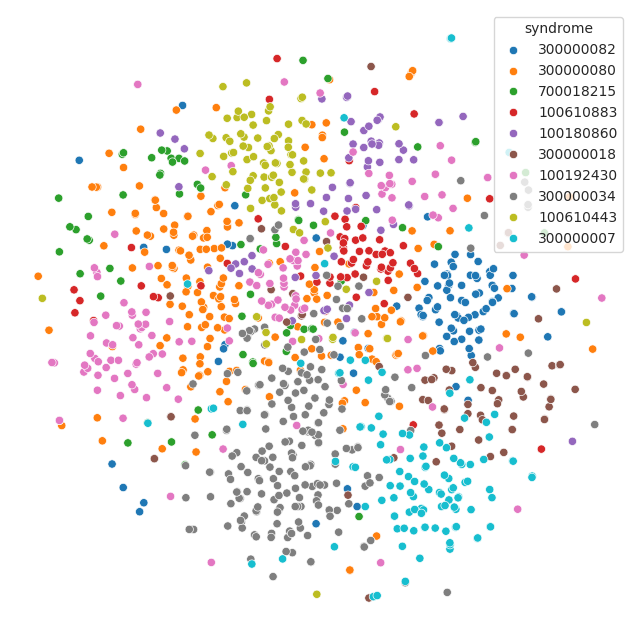
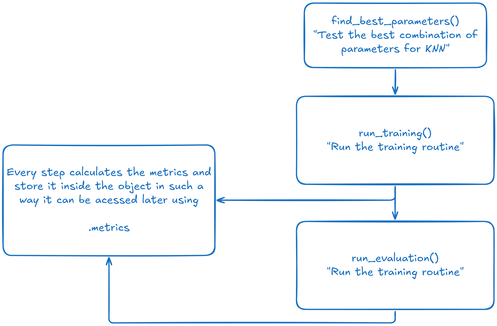
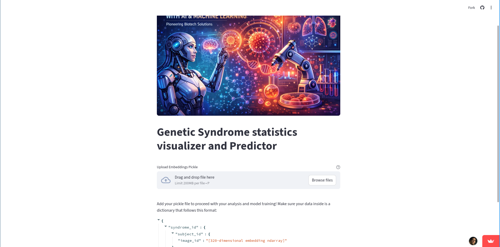
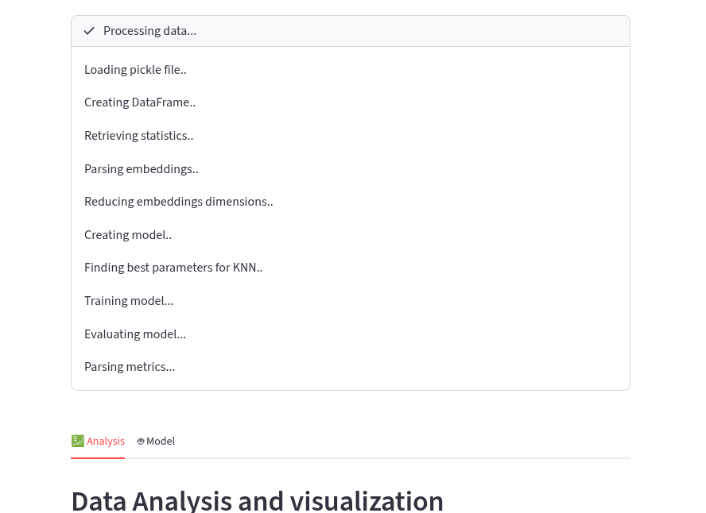

# Apollo Project

## A Classification model for Genetic Syndromes

This project is my solutions for the  [Apollo Solutions Dev](https://apollosolutionsdev.com/)'s developer test.

Our goal was to create a comprehensive pipeline that includes data preprocessing, visualization, classification, manual implementation of key metrics, and insightful analysis.

To tackle this problem, I implemented this application using Python and `Streamlit` to create a better experience.

> Disclaimer: To test it quickly, I first did some jupyter notebooks and then transferred the knowledge into python script. These notebooks can be accessed in the `experiments` folder.

## Data Processing and analysis

In [analysis.py](./analysis.py) I've created a set of functions that allowed me to easily handle the input data and extract information.

The functions can be used as you wish, but in general, the workflow would be something like:



Nothing too extraordinary is done here, but these are the fundamental pieces for the model developmenet.

> It's worth noticing that T-SNE is tricky to find the optimal parameters for a dataset. I did some research before, tested some parameters and set them as default here. The set of parameters are: perplexity=50 init=pca learning_rate=800, also employing l2 normalization gave the best results during our testing batch.




## Model Creating

For the model, it was created a python class in [model.py](./model.py) that handles everything related to it. So the class has methods for finding the best parameters using `GridSearchCV`, training the model, retrieving the metrics, handling Cross-Validation and averaging the ROC-AUC metric across olds.

The model used was the KNN for both `cosine` and `euclidean` metric, and tested `n-neighbors` up to 15, as requested.

Everything was implemented based on `scikit-learn` machinery.

The code flow inside the model is something like:




## Dashboard



The dashboard was created entirely using `streamlit`.

The way it was developed, allows you to simply drop a pickle file and it'll do everything by itself, and the process can be seen in the status widget:



The project was deployed to the cloud, so it can be accessed here: [https://apollo-project.streamlit.app/](https://apollo-project.streamlit.app/)

Or running locally as specified in [run local section](#run-local).

## Run Local

To run it locally, first you need to install the dependencies. It's a good ideia to use a virtual environment.
I recommend you installing [uv](https://docs.astral.sh/uv), but [venv](https://docs.python.org/3/library/venv.html) is also a solid choice.

> In case you're not using uv, first create a virtual environment and activate it to proceed

then run:


```bash

# for pip/venv
pip install -r requirements.txt

# for uv
uv sync

# or use the command your virtual environment manager provides you to install packages
```

After that, you may be allowed to start the `streamlit` server, so run:

```bash

# for pip/venv
streamlit run dashboard.py

# for uv
uv run streamlit run dashboard.py
# or
make run
```

If it you suceeded, you'll see an url in your terminal, accessing it you'll have the dashboard up and running :)

